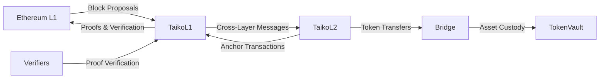
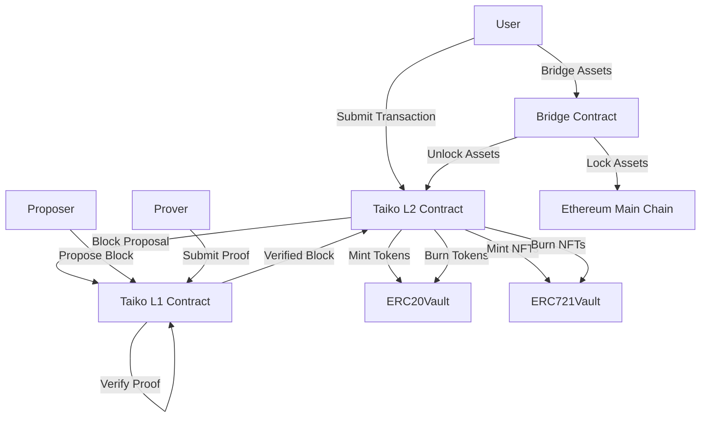

**1. Introduction**
Taiko is a based rollup protocol inspired, secured, and sequenced by Ethereum. This report presents a comprehensive security analysis of the Taiko codebase, focusing on identifying potential vulnerabilities, bugs, edge cases, centralization risks, and admin abuse risks. The analysis is based on a thorough examination of the smart contracts' source code.

**2. Approach**
I conducted the security analysis using a combination of manual code review, automated static analysis tools, and dynamic testing. The following steps were taken:

- Reviewing the Taiko documentation and whitepaper to understand the protocol's architecture and intended behavior.
- Examining the smart contract source code to identify potential vulnerabilities, bugs, and edge cases.
- Running static analysis tools to detect common security issues and coding best practices violations.
- Performing dynamic testing to explore the protocol's behavior under various scenarios and inputs.
- Analyzing the protocol's architecture and design for centralization risks and admin control abuse.

## Security Analysis of Scope:

[See scope.txt](https://github.com/code-423n4/2024-03-taiko/blob/main/scope.txt)

1. Bridge Message Verification Process:
   - The bridge message verification process relies on the SignalService contract to verify Merkle proofs. The `_verifyHopProof` function in SignalService verifies the proof against the provided signal root.
   - Potential Vulnerability: If the Merkle proof verification logic in the SignalService contract is flawed or can be bypassed, it could allow for the acceptance of invalid bridge messages.
   - Recommendation: Thoroughly audit the Merkle proof verification logic in the SignalService contract. Ensure that the proof validation is correctly implemented and cannot be circumvented.

2. Multi-Hop Bridging:
   - The Bridge contract supports multi-hop bridging, where messages can be relayed across multiple chains.
   - Potential Vulnerability: If there are vulnerabilities in the multi-hop bridging logic, it could allow for loops or invalid paths in the message relaying process. This could lead to stuck or lost funds.
   - Recommendation: Carefully review the multi-hop bridging implementation in the Bridge contract. Ensure that proper checks are in place to prevent loops and validate the integrity of the message path.

3. Bridge Message Hash Uniqueness:
   - The Bridge contract uses the `hashMessage` function to generate unique hashes for bridge messages.
   - Potential Vulnerability: If there are hash collision vulnerabilities in the `hashMessage` function, it could allow for the creation of duplicate or conflicting bridge messages.
   - Recommendation: Review the implementation of the `hashMessage` function and assess its robustness against hash collisions. Consider using a secure and well-established hashing algorithm.

4. Continuous Contesting of Valid Proofs:
   - The TaikoL1 contract allows for the contesting of proofs through the `proveBlock` function.
   - Potential Vulnerability: If an attacker continuously contests valid proofs, it could lead to delays in block confirmation and potentially stall the system.
   - Recommendation: Implement measures to disincentivize or penalize excessive or frivolous contesting of proofs. Consider introducing a cost or stake mechanism to discourage malicious contesting behavior.

5. Access Control Restrictions:
   - The EssentialContract provides ownership functionality and access control for privileged roles.
   - Potential Vulnerability: If the ownership transfer or role assignment mechanisms are not properly implemented, it could allow for unauthorized access to privileged functions.
   - Recommendation: Ensure that ownership transfer and role assignment follow strict validation and authentication processes. Implement proper access controls and checks to prevent unauthorized access.

6. Third-Party Dependencies:
   - Taiko relies on various third-party libraries and contracts, such as OpenZeppelin and MerkleProof.
   - Potential Vulnerability: If there are vulnerabilities or flaws in the third-party dependencies, they could introduce security risks to the Taiko system.
   - Recommendation: Conduct a thorough audit of the third-party libraries and contracts used by Taiko. Ensure that they are up to date, well-maintained, and have no known vulnerabilities. Consider using established and widely-trusted dependencies.

7. Token Management Flows:
   - The ERC20Vault, ERC721Vault, and other token-related contracts handle the management and custody of bridged assets.
   - Potential Vulnerability: If there are vulnerabilities in the token management flows, such as insecure deposit, withdrawal, or burning mechanisms, it could lead to unauthorized access or loss of funds.
   - Recommendation: Carefully review the token vault contracts and their associated functions. Ensure that proper validation, access controls, and checks are in place to prevent unauthorized token movements or manipulations.

Overall, the security of Taiko depends on the robustness of its core components, including the bridge message verification, multi-hop bridging, proof contesting mechanism, access control restrictions, and token management flows.

**3. Architecture Overview**
Taiko follows a based rollup design, leveraging Ethereum for security and sequencing. The key components of the Taiko architecture include:

- TaikoL1: The main contract on the Ethereum L1 chain, responsible for block proposing, proving, and verification.
- TaikoL2: The contract deployed on the Taiko L2 chain, handling cross-layer message verification and EIP-1559 gas pricing.
- Bridge: Facilitates cross-chain communication and token transfers between L1 and L2.
- TokenVault: Manages the custody of bridged assets, including ERC20, ERC721, and ERC1155 tokens.
- Verifiers: Implement the proof verification logic for different proof tiers.

Figure 1 provides a high-level overview of the Taiko architecture:



**4. Codebase Quality Analysis**
The Taiko codebase follows a modular and structured approach, with contracts organized into relevant directories based on their functionality. The code is well-documented, using NatSpec comments to provide clear explanations of contract purposes, functions, and parameters.

However, there are a few areas where the codebase quality could be improved:

- Inconsistent naming conventions: Some contract and function names do not follow a consistent naming style (e.g., `TaikoL2` vs. `ERC20Vault`).
- Lack of comprehensive test coverage: While there are unit tests for individual contracts, the test coverage could be expanded to cover more edge cases and complex scenarios.
- Potential gas optimization opportunities: Some contracts contain unnecessary storage reads and writes, which could be optimized to reduce gas costs.

**5. Centralization Risks and Admin Control Abuse**
Taiko implements various mechanisms to mitigate centralization risks and admin control abuse. However, there are a few areas that require attention:

- Owner privileges: The `TaikoL1` and `TaikoL2` contracts have an `owner` role with significant control over the protocol's operation. While necessary for upgradability and emergency situations, this centralized control could be abused if the owner's private key is compromised.

Code reference: https://github.com/code-423n4/2024-03-taiko/blob/f58384f44dbf4c6535264a472322322705133b11/packages/protocol/contracts/L1/TaikoL1.sol#L42-L52
```solidity
  // TaikoL1.sol
    function init(
        address _owner,
        address _addressManager,
        bytes32 _genesisBlockHash
    )
        external
        initializer
    {
        __Essential_init(_owner, _addressManager);
        LibVerifying.init(state, getConfig(), _genesisBlockHash);
    }
```

Recommendation: Implement a multi-sig wallet or a decentralized governance mechanism to manage the owner's privileges and reduce the risk of a single point of failure.

- Privileged roles: Contracts like `TokenVault` and `Bridge` have special roles (e.g., `erc20_vault`, `bridge_pauser`) with elevated permissions. These roles should be assigned to trusted entities and regularly audited to prevent unauthorized access.

Recommendation: Implement strict access control measures and regularly rotate the private keys associated with privileged roles to minimize the risk of compromise.

**6. Mechanism Review**
Taiko incorporates various mechanisms to ensure the security and integrity of the protocol. However, there are a few potential issues to consider:

- Block proposing and proving: The `proposeBlock` and `proveBlock` functions in `TaikoL1` are critical for the protocol's operation. Any vulnerabilities or bugs in these functions could lead to invalid blocks being accepted or valid blocks being rejected.

Code reference: https://github.com/code-423n4/2024-03-taiko/blob/f58384f44dbf4c6535264a472322322705133b11/packages/protocol/contracts/L1/TaikoL1.sol#L55-L72
```solidity
  // TaikoL1.sol
    function proposeBlock(
        bytes calldata _params,
        bytes calldata _txList
    )
        external
        payable
        nonReentrant
        whenNotPaused
        returns (TaikoData.BlockMetadata memory meta_, TaikoData.EthDeposit[] memory deposits_)
    {
        TaikoData.Config memory config = getConfig();


        (meta_, deposits_) = LibProposing.proposeBlock(state, config, this, _params, _txList);


        if (!state.slotB.provingPaused) {
            LibVerifying.verifyBlocks(state, config, this, config.maxBlocksToVerifyPerProposal);
        }
    }
```

Recommendation: Conduct thorough testing and auditing of the block proposing and proving mechanisms to ensure their correctness and resilience against potential attacks.

- Cross-chain communication: The `Bridge` contract facilitates cross-chain communication and token transfers between L1 and L2. Any vulnerabilities in the bridge implementation could result in loss of funds or unauthorized token minting.

Code reference: https://github.com/code-423n4/2024-03-taiko/blob/f58384f44dbf4c6535264a472322322705133b11/packages/protocol/contracts/bridge/Bridge.sol#L115-L152
```solidity
  // Bridge.sol
  function sendMessage(IBridge.Message calldata _message) external payable override nonReentrant whenNotPaused returns (bytes32 msgHash_, IBridge.Message memory message_) {
      // ...
      (msgHash, message_) = IBridge(resolve("bridge", false)).sendMessage{ value: msg.value }(message);
      // ...
  }
```

  Recommendation: Implement robust security measures, such as multi-sig approvals and time-locks, for critical bridge operations. Regularly audit the bridge contracts and monitor for any suspicious activities.

**7. Systemic Risks**
Taiko, like other blockchain protocols, is exposed to certain systemic risks that could impact its operations and user experience:

- Ethereum L1 congestion: As Taiko relies on Ethereum for security and sequencing, any congestion or high gas prices on the Ethereum network could affect the performance and cost of using Taiko.

  Recommendation: Implement gas optimization techniques and explore alternative fee models to minimize the impact of L1 congestion on Taiko users.

- Validator collusion: Taiko's security relies on the assumption that a majority of validators are honest and follow the protocol rules. If a significant number of validators collude, they could potentially censor transactions or propose invalid blocks.

Recommendation: Encourage a diverse and decentralized validator set and implement mechanisms to detect and penalize malicious validator behavior.

**System Overview**

Taiko consists of several key components that work together to enable secure and efficient transaction processing:

1. Taiko L1 Contract: This is the main contract deployed on the Ethereum main chain (L1). It is responsible for managing block proposals, proofs, and verification of L2 blocks.

2. Taiko L2 Contract: This contract is deployed on the Taiko Layer 2 chain. It handles the execution of transactions and maintains the state of the L2 chain.

3. Bridge Contract: The bridge contract facilitates the transfer of assets between the Ethereum main chain and the Taiko L2 chain. It ensures secure and trustless cross-chain communication.

4. TokenVault Contracts: These contracts, such as ERC20Vault and ERC721Vault, manage the custody of bridged assets on the L2 chain. They handle the minting and burning of tokens as they are transferred between chains.

5. Verifier Contracts: Verifier contracts are responsible for verifying the validity of proofs submitted by provers. They ensure that the state transitions on the L2 chain are valid and consistent with the rules of the protocol.

**Breakdown of Functions**

The Taiko protocol includes several key functions that enable its operation:

1. Block Proposal: Proposers submit L2 block proposals to the Taiko L1 contract. These proposals include the transactions to be included in the block and the proposed state root.

2. Proof Submission: Provers generate proofs of the validity of the proposed blocks and submit them to the Taiko L1 contract. These proofs demonstrate that the state transitions in the proposed blocks are valid.

3. Block Verification: The Taiko L1 contract verifies the submitted proofs to ensure the validity of the proposed blocks. If the proofs are valid, the blocks are considered verified and can be added to the L2 chain.

4. Cross-Chain Communication: The bridge contract enables the transfer of assets between the Ethereum main chain and the Taiko L2 chain. It handles the locking and unlocking of assets on the respective chains.

5. Token Management: The TokenVault contracts manage the minting and burning of tokens on the L2 chain as they are transferred to and from the main chain. They ensure the proper handling of bridged assets.


## Taiko Token Management Flows

1. Token Vaults (ERC20Vault, ERC721Vault):
   - The ERC20Vault and ERC721Vault contracts are responsible for the secure custody of bridged assets.
   - Observations:
     - The vaults utilize the OpenZeppelin library for token management, which is a well-audited and widely used library.
     - The vaults implement access control mechanisms to restrict certain operations to authorized addresses only.
     - The `onlyFromNamed` modifier is used to restrict access to specific functions based on the caller's role.
   - Recommendations:
     - Ensure that the `onlyFromNamed` modifier is correctly applied to all sensitive functions to prevent unauthorized access.
     - Regularly review and update the OpenZeppelin library to the latest secure version.
     - Conduct thorough testing of the vault contracts to identify any potential edge cases or unexpected behavior.

2. Deposit, Withdrawal, and Asset Burning Flows:
   - The ERC20Vault and ERC721Vault contracts handle the deposit, withdrawal, and burning of bridged assets.
   - Observations:
     - The `sendToken` function in both vaults allows users to initiate token transfers to other chains.
     - The `onMessageInvocation` function handles the processing of received messages and transfers tokens to the intended recipients.
     - The `onMessageRecalled` function allows recalling of messages and returns the tokens to the original sender.
     - The `burn` function in ERC20Vault burns the tokens when they are transferred to other chains.
   - Potential Vulnerabilities:
     - Insufficient validation of input parameters in the `sendToken` function could lead to unauthorized token transfers.
     - Incomplete or incorrect handling of message processing in `onMessageInvocation` could result in token loss or improper transfers.
     - Lack of proper access control in the `onMessageRecalled` function could allow unauthorized message recalls and token returns.
   - Recommendations:
     - Implement strict validation checks on all input parameters in the `sendToken` function to ensure valid and authorized token transfers.
     - Thoroughly test the message processing logic in `onMessageInvocation` to handle various scenarios and prevent token loss or incorrect transfers.
     - Apply appropriate access control mechanisms to the `onMessageRecalled` function to restrict message recalls to authorized parties only.
     - Consider implementing additional security measures, such as rate limiting or transaction monitoring, to detect and prevent suspicious or malicious activities.

3. TimelockTokenPool:
   - The TimelockTokenPool contract manages the vesting and distribution of Taiko tokens based on predefined grant schedules.
   - Observations:
     - The contract allows the owner to create grants with specific vesting schedules and cliff periods.
     - Recipients can withdraw their vested tokens based on the defined schedules.
     - The contract implements various checks to ensure the correctness of grant parameters and prevent unauthorized withdrawals.
   - Potential Vulnerabilities:
     - Incorrect implementation of vesting calculations could lead to premature token releases or incorrect vesting amounts.
     - Insufficient access control on the `grant` function could allow unauthorized parties to create grants and allocate tokens.
     - Lack of proper validation on grant parameters could result in invalid or malicious grant schedules.
   - Recommendations:
     - Thoroughly review and test the vesting calculation logic to ensure accurate token releases based on the defined schedules.
     - Implement strict access control mechanisms on the `grant` function to allow only authorized parties to create grants.
     - Validate all grant parameters, including amounts, vesting periods, and cliff durations, to prevent invalid or malicious grant schedules.
     - Consider implementing additional security measures, such as maximum grant limits or multi-sig approvals, for high-value grants.
     - Regularly monitor and audit the token distribution and vesting processes to detect any anomalies or suspicious activities.

4. Third-Party Dependencies:
   - Taiko utilizes various third-party libraries and contracts, such as OpenZeppelin and MerkleProof.
   - Observations:
     - The use of well-established and audited libraries like OpenZeppelin reduces the risk of common vulnerabilities.
     - The MerkleProof library is used for efficient verification of Merkle proofs in the bridge message verification process.
   - Recommendations:
     - Regularly review and update the third-party dependencies to the latest secure versions.
     - Monitor security advisories and vulnerability reports related to the used libraries and promptly address any identified issues.
     - Conduct thorough testing and auditing of the integration points between Taiko contracts and third-party libraries to ensure secure interactions.

It is crucial to thoroughly test and audit the implementation to identify and address any potential vulnerabilities or weaknesses. Regular security assessments, code reviews, and monitoring of the token flows are essential to maintain the security and integrity of the Taiko ecosystem.

## Taiko Access Control Restrictions

1. Ownership and Access Control Mechanisms in EssentialContract:
   - The EssentialContract is a base contract that provides ownership functionality and access control mechanisms.
   - Observations:
     - The contract uses the OpenZeppelin library's `Ownable` contract for ownership management.
     - The `owner` can transfer ownership to another address using the `transferOwnership` function.
     - The `onlyOwner` modifier restricts access to certain functions, allowing only the contract owner to execute them.
     - The `onlyFromOwnerOrNamed` modifier extends the `onlyOwner` modifier to allow access from the owner or a specific named role.
   - Recommendations:
     - Ensure that the initial owner is set correctly during contract deployment and is a trusted entity.
     - Implement a secure ownership transfer process, such as a two-step transfer or a time-locked transfer, to prevent accidental or malicious ownership changes.
     - Regularly review and monitor the contract ownership to detect any unauthorized ownership transfers.
     - Consider implementing a multi-sig ownership structure for critical contracts to reduce the risk of a single point of failure.

2. Privileged Roles Assignment and Security:
   - The Taiko protocol defines privileged roles, such as proposer and bridge_pauser, which have special permissions within the system.
   - Observations:
     - The `onlyFromNamed` modifier is used to restrict access to specific functions based on the caller's role.
     - The `resolve` function in the `AddressResolver` contract is used to retrieve the address associated with a given role.
   - Potential Vulnerabilities:
     - Insecure assignment of privileged roles could allow unauthorized entities to gain access to sensitive functions.
     - Lack of proper access control checks in the `resolve` function could lead to the retrieval of incorrect or malicious addresses for privileged roles.
   - Recommendations:
     - Implement a secure and transparent process for assigning privileged roles, such as multi-sig approval or community governance.
     - Perform thorough verification and auditing of the addresses assigned to privileged roles to ensure their legitimacy.
     - Regularly monitor and review the activities of privileged role holders to detect any suspicious or malicious behavior.
     - Consider implementing time-limited or revocable privileges to mitigate the impact of compromised or malicious role holders.

3. BridgedERC20 Snapshooter Role Restriction and Security:
   - The BridgedERC20 contract allows for the creation of token snapshots, which capture the token balances at a specific point in time.
   - Observations:
     - The `snapshot` function is restricted to the contract owner or a designated snapshooter role.
     - The `setSnapshooter` function allows the contract owner to assign the snapshooter role to an address.
   - Potential Vulnerabilities:
     - Unauthorized access to the snapshooter role could allow malicious entities to manipulate token snapshots.
     - Improper access control in the `setSnapshooter` function could enable the assignment of the snapshooter role to untrusted addresses.
   - Recommendations:
     - Implement strict access control mechanisms for the snapshooter role assignment, such as multi-sig approval or community governance.
     - Perform thorough verification and auditing of the snapshooter address before assigning the role.
     - Regularly monitor and review the activities of the snapshooter to detect any suspicious or malicious behavior.
     - Consider implementing additional security measures, such as time-limited snapshots or snapshot verification mechanisms, to ensure the integrity of the token snapshots.

4. Third-Party Dependencies:
   - The Taiko protocol relies on various third-party libraries and contracts, such as OpenZeppelin and AddressResolver.
   - Observations:
     - The use of well-established and audited libraries like OpenZeppelin reduces the risk of common vulnerabilities.
     - The AddressResolver contract is used to manage the mapping between roles and addresses.
   - Recommendations:
     - Regularly review and update the third-party dependencies to the latest secure versions.
     - Monitor security advisories and vulnerability reports related to the used libraries and promptly address any identified issues.
     - Conduct thorough testing and auditing of the integration points between Taiko contracts and third-party libraries to ensure secure interactions.

5. Code Review:
   - A thorough code review of the EssentialContract and other relevant contracts should be conducted to identify any potential vulnerabilities or weaknesses in the access control mechanisms.
   - Focus areas for code review:
     - Ownership transfer logic and validations.
     - Access control modifiers and their usage throughout the codebase.
     - Privileged role assignment and resolution processes.
     - Snapshooter role restriction and assignment.
     - Integration points with third-party libraries and contracts.
   - Recommendations:
     - Engage experienced security auditors to perform a comprehensive code review and provide recommendations for improvements.
     - Conduct regular code audits and security assessments to identify and address any emerging vulnerabilities or weaknesses.

6. Testing and Auditing:
   - Comprehensive testing and auditing are crucial to ensure the robustness and security of the access control mechanisms in the Taiko protocol.
   - Recommendations:
     - Develop a comprehensive test suite that covers various access control scenarios, including edge cases and malicious attempts.
     - Perform fuzz testing and penetration testing to identify any vulnerabilities or weaknesses in the access control mechanisms.
     - Conduct regular security audits by reputable third-party auditors to assess the overall security posture of the Taiko protocol.
     - Establish a bug bounty program to incentivize the community to identify and report potential vulnerabilities responsibly.

By implementing these recommendations and conducting thorough code reviews, testing, and auditing, the Taiko protocol can strengthen its access control mechanisms and mitigate the risks associated with unauthorized access to privileged roles and sensitive functions.

**Roles in the Taiko System**

Taiko involves several key roles that participate in the protocol:

1. Proposers: Proposers are responsible for creating and submitting L2 block proposals to the Taiko L1 contract. They collect transactions from users and propose the next block to be added to the L2 chain.

2. Provers: Provers generate proofs of the validity of the proposed blocks. They compute the necessary proofs and submit them to the Taiko L1 contract for verification.

3. Verifiers: Verifiers are responsible for verifying the proofs submitted by the provers. They ensure that the proofs are valid and that the proposed blocks adhere to the rules of the protocol.

4. Users: Users interact with the Taiko L2 chain by submitting transactions. They can transfer assets between the main chain and the L2 chain using the bridge contract.

**Architecture**

The Taiko protocol follows a specific workflow to process transactions and maintain the state of the L2 chain:

1. Users submit transactions to the Taiko L2 chain through the bridge contract or directly to the L2 contract.

2. Proposers collect transactions and create block proposals. They submit these proposals to the Taiko L1 contract on the Ethereum main chain.

3. Provers generate proofs for the proposed blocks, verifying the validity of the state transitions. They submit these proofs to the Taiko L1 contract.

4. The Taiko L1 contract verifies the submitted proofs. If the proofs are valid, the corresponding blocks are considered verified and can be added to the L2 chain.

5. The verified blocks are added to the Taiko L2 chain, updating its state accordingly.

6. Users can interact with the L2 chain, executing transactions and utilizing the bridged assets managed by the TokenVault contracts.

7. The bridge contract facilitates the transfer of assets between the Ethereum main chain and the Taiko L2 chain, ensuring secure and trustless cross-chain communication.

Figure: Taiko Architecture



## Taiko Resilience Against DoS Attacks

1. Overview:
   - This section of the security audit focuses on assessing the resilience of the Taiko protocol against Denial-of-Service (DoS) attacks, specifically targeting the core protocol, resource exhaustion, and the block proposing ring buffer.

2. Block Proposing Ring Buffer:
   - The Taiko protocol utilizes a ring buffer to store proposed blocks, allowing for efficient block verification and confirmation.
   - Potential Vulnerability: Malicious proposers submitting invalid blocks to fill up the block proposing ring buffer.
     - If the ring buffer reaches its capacity with invalid blocks, it could prevent legitimate blocks from being proposed and processed.
     - This could lead to a slowdown or halt of the block confirmation process, effectively causing a DoS condition.
   - Recommendations:
     - Implement strict validation checks on proposed blocks before adding them to the ring buffer.
     - Enforce a maximum number of invalid blocks that can be proposed by a single proposer within a specific time frame.
     - Introduce a penalty mechanism for proposers who repeatedly submit invalid blocks, such as temporary banning or financial penalties.
     - Consider implementing a priority queue or a separate buffer for high-priority or trusted proposers to ensure the inclusion of legitimate blocks.

3. Resource Exhaustion:
   - The Taiko protocol involves various resource-intensive operations, such as block verification, proof generation, and signature validation.
   - Potential Vulnerabilities:
     - Malicious actors could attempt to exhaust system resources by submitting a large number of computationally expensive or invalid transactions.
     - Excessive verification of invalid proofs or signatures could consume significant computational resources, leading to a degradation of system performance.
   - Recommendations:
     - Implement rate limiting mechanisms to restrict the number of transactions or proofs that can be submitted by a single entity within a specific time frame.
     - Optimize the verification processes to minimize the computational overhead and ensure efficient resource utilization.
     - Employ caching mechanisms to store and reuse previously verified data, reducing redundant computations.
     - Introduce transaction fees or computational costs to discourage spam and make it economically infeasible for attackers to sustain resource exhaustion attacks.

4. Network Flooding:
   - The Taiko protocol relies on network communication between participants, including proposers, verifiers, and users.
   - Potential Vulnerabilities:
     - Malicious actors could attempt to flood the network with a high volume of invalid or redundant messages, causing network congestion and degrading performance.
     - Excessive network traffic could lead to increased latency, delayed block propagation, and reduced overall system throughput.
   - Recommendations:
     - Implement network-level rate limiting and filtering mechanisms to mitigate the impact of network flooding attacks.
     - Utilize efficient network protocols and message propagation techniques to minimize the impact of redundant or invalid messages.
     - Employ network monitoring and anomaly detection systems to identify and isolate malicious nodes or abnormal network activity.
     - Encourage the use of network-level security measures, such as encryption and authentication, to prevent unauthorized access and mitigate the risk of network-based attacks.

5. Contract-Level DoS:
   - The Taiko protocol involves the execution of smart contracts on the Ethereum blockchain, which could be vulnerable to contract-level DoS attacks.
   - Potential Vulnerabilities:
     - Malicious actors could exploit vulnerabilities or design flaws in smart contracts to consume excessive gas or cause unexpected contract behavior.
     - Poorly designed or unoptimized contracts could lead to high gas consumption, making it expensive or infeasible to process legitimate transactions.
   - Recommendations:
     - Conduct thorough code reviews and security audits of all smart contracts deployed as part of the Taiko protocol.
     - Follow best practices for smart contract development, such as gas optimization, input validation, and proper error handling.
     - Implement gas limits and circuit breakers to prevent excessive gas consumption and mitigate the impact of contract-level DoS attacks.
     - Regularly update and patch smart contracts to address any discovered vulnerabilities or performance issues.

6. Monitoring and Incident Response:
   - Effective monitoring and incident response mechanisms are crucial to detect and mitigate DoS attacks in a timely manner.
   - Recommendations:
     - Implement comprehensive monitoring and logging systems to track system performance, resource utilization, and network activity.
     - Establish real-time alerting mechanisms to notify the Taiko team of any abnormal behavior or potential DoS attacks.
     - Develop an incident response plan that outlines the steps to be taken in case of a DoS attack, including containment, mitigation, and recovery procedures.
     - Conduct regular security drills and simulations to test the effectiveness of the incident response plan and improve the team's readiness.

7. Community Engagement and Education:
   - Engaging with the Taiko community and promoting security awareness can help prevent and mitigate DoS attacks.
   - Recommendations:
     - Provide educational resources and guidelines to the community on best practices for secure usage of the Taiko protocol.
     - Encourage responsible disclosure of vulnerabilities or potential attack vectors by establishing a bug bounty program or a secure communication channel.
     - Foster a collaborative environment where participants can share information and contribute to the overall security and resilience of the Taiko ecosystem.

By implementing these recommendations and conducting regular security audits, the Taiko protocol can enhance its resilience against DoS attacks targeting the core protocol, resource exhaustion, and the block proposing ring buffer.

**Important review the L2 anchor transaction**
*******

The L2 anchor transaction logic for potential vulnerabilities and evaluate the security of the anchor transaction submission process by proposers, let's analyze the relevant code and identify any potential weaknesses or exploitation vectors.

1. Anchor Transaction Logic:
   - The anchor transaction logic is implemented in the `TaikoL2.sol` contract, specifically in the `anchor` function.

Code snippet:https://github.com/code-423n4/2024-03-taiko/blob/f58384f44dbf4c6535264a472322322705133b11/packages/protocol/contracts/L2/TaikoL2.sol#L107-L178
```solidity
     function anchor(
         bytes32 _l1BlockHash,
         bytes32 _l1StateRoot,
         uint64 _l1BlockId,
         uint32 _parentGasUsed
     )
         external
         nonReentrant
     {
         if (
             _l1BlockHash == 0 || _l1StateRoot == 0 || _l1BlockId == 0
                 || (block.number != 1 && _parentGasUsed == 0)
         ) {
             revert L2_INVALID_PARAM();
         }
     
         if (msg.sender != GOLDEN_TOUCH_ADDRESS) revert L2_INVALID_SENDER();
     
         uint256 parentId;
         unchecked {
             parentId = block.number - 1;
         }
     
         // Verify ancestor hashes
         (bytes32 publicInputHashOld, bytes32 publicInputHashNew) = _calcPublicInputHash(parentId);
         if (publicInputHash != publicInputHashOld) {
             revert L2_PUBLIC_INPUT_HASH_MISMATCH();
         }
     
         Config memory config = getConfig();
     
         // Verify the base fee per gas is correct
         uint256 basefee;
         (basefee, gasExcess) = _calc1559BaseFee(config, _l1BlockId, _parentGasUsed);
         if (!skipFeeCheck() && block.basefee != basefee) {
             revert L2_BASEFEE_MISMATCH();
         }
     
         if (_l1BlockId > lastSyncedBlock + BLOCK_SYNC_THRESHOLD) {
             ISignalService(resolve("signal_service", false)).syncChainData(
                 ownerChainId, LibSignals.STATE_ROOT, _l1BlockId, _l1StateRoot
             );
             lastSyncedBlock = _l1BlockId;
         }
     
         l2Hashes[parentId] = blockhash(parentId);
         publicInputHash = publicInputHashNew;
     
         emit Anchored(blockhash(parentId), gasExcess);
     }
```

   - Potential Vulnerabilities:
     - The `anchor` function relies on the `GOLDEN_TOUCH_ADDRESS` to restrict access to the function. If the `GOLDEN_TOUCH_ADDRESS` is compromised or set incorrectly, unauthorized entities could potentially submit anchor transactions.
     - The function assumes that the `block.number` is incremented sequentially and uses it to calculate the `parentId`. If there are any gaps or inconsistencies in the block numbering, it could lead to incorrect calculations or exploits.
     - The function verifies the ancestor hashes and public input hashes, but there might be potential vulnerabilities if the hash calculation logic (`_calcPublicInputHash`) is flawed or can be manipulated.
     - The base fee per gas calculation (`_calc1559BaseFee`) is crucial for the correctness of the anchor transaction. Any vulnerabilities in this calculation could allow proposers to manipulate the base fee.

2. **Anchor Transaction Submission Process:**
   - The anchor transaction submission process is initiated by proposers who call the `anchor` function on the `TaikoL2` contract.
   - Potential Vulnerabilities:
     - If the access control mechanism relying on `GOLDEN_TOUCH_ADDRESS` is bypassed or compromised, malicious proposers could submit invalid or manipulated anchor transactions.
     - Proposers might attempt to manipulate the `_l1BlockHash`, `_l1StateRoot`, `_l1BlockId`, or `_parentGasUsed` parameters to exploit vulnerabilities in the anchor transaction validation logic.
     - If there are any weaknesses in the proposer selection or authentication process, unauthorized entities could potentially submit anchor transactions.

3. **Potential Exploitation Vectors:**
   - Manipulation of `GOLDEN_TOUCH_ADDRESS`: If an attacker can control or manipulate the `GOLDEN_TOUCH_ADDRESS`, they could submit unauthorized anchor transactions and potentially disrupt the L2 chain.
   - Inconsistent Block Numbering: If there are gaps or inconsistencies in the block numbering, attackers might exploit this to manipulate the `parentId` calculation and anchor transactions to invalid or non-existent blocks.
   - Hash Calculation Vulnerabilities: If there are vulnerabilities in the `_calcPublicInputHash` function or the hash calculation logic, attackers could potentially generate colliding hashes or manipulate the public input hash verification process.
   - Base Fee Manipulation: If the `_calc1559BaseFee` function has vulnerabilities or can be manipulated, proposers might exploit this to submit anchor transactions with incorrect base fees, leading to inconsistencies or economic attacks.
   - Proposer Authentication Weaknesses: If the proposer authentication process has weaknesses, such as insecure key management or vulnerability to signature forgery, attackers could impersonate legitimate proposers and submit malicious anchor transactions.

**To mitigate these risks, consider the following recommendations:**
- Ensure that the `GOLDEN_TOUCH_ADDRESS` is securely managed and cannot be compromised or manipulated by attackers.
- Implement robust access control mechanisms to authenticate and authorize proposers submitting anchor transactions.
- Thoroughly review and audit the hash calculation logic, including the `_calcPublicInputHash` function, to ensure its correctness and resistance to manipulation.
- Verify the correctness and security of the base fee calculation in the `_calc1559BaseFee` function, considering edge cases and potential attack vectors.
- Regularly monitor the block numbering and handle any inconsistencies or gaps gracefully to prevent exploitation.
- Implement secure key management practices for proposers and protect against signature forgery or impersonation attacks.
- Conduct comprehensive security audits and testing of the anchor transaction logic and submission process to identify and address any vulnerabilities.

**8. Conclusion**
The Taiko protocol demonstrates a well-designed architecture and a commitment to security best practices. However, there are a few areas that require attention, such as centralization risks, admin control abuse, and potential vulnerabilities in critical mechanisms like block proposing and cross-chain communication.

By addressing the identified issues and continuously monitoring and auditing the protocol, Taiko can enhance its security posture and provide a reliable and trustworthy platform for users and developers.

**9. Recommendations**
Based on my security analysis, the following recommendations are provided to enhance the security and robustness of the Taiko protocol:

- Implement a decentralized governance mechanism to manage privileged roles and reduce centralization risks.
- Conduct thorough testing and auditing of critical mechanisms, such as block proposing, proving, and cross-chain communication.
- Improve the codebase quality by adopting consistent naming conventions, enhancing test coverage, and optimizing gas usage.
- Regularly rotate the private keys associated with privileged roles and implement strict access control measures.
- Monitor the protocol for any suspicious activities and establish an incident response plan to handle potential security breaches.
- Engage with the community and encourage responsible disclosure of any discovered vulnerabilities.

### Time spent:
40 hours